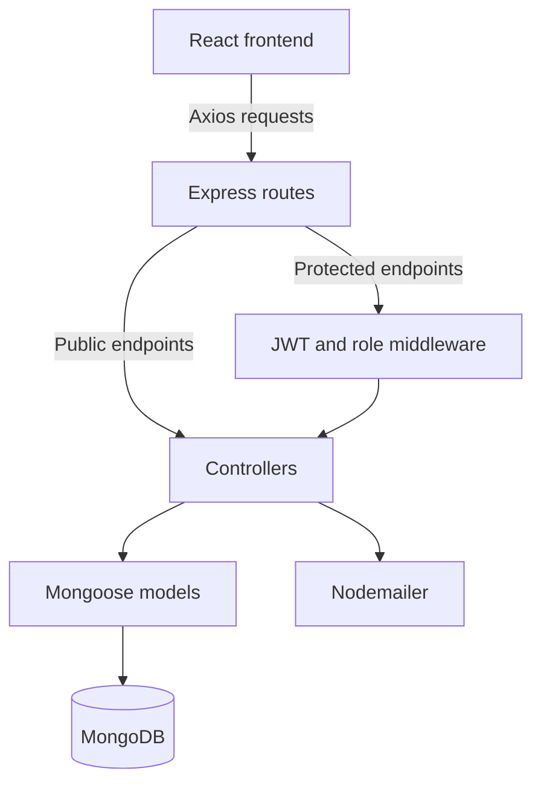

# Inventory Management System

A full-stack **Inventory Management System** built using the **MERN Stack (MongoDB, Express.js, React.js, Node.js)**. The application provides inventory, supplier, product, category, order, and staff management through role-specific dashboards.

The backend follows a modular RESTful architecture with JWT-based authentication and role-based authorization, while the frontend delivers a responsive user experience using React and Vite.

---

## Features

### Authentication
- User Registration & Login
- Forgot Password & Password Reset
- JWT Authentication
- Protected Routes
- Role-Based Access Control

### Inventory Management
- Warehouse Stock Management
- Product Management
- Category Management
- Supplier Management
- Order Management

### Staff Management
- Staff Profile Management
- Staff Administration
- Role Management (Master Admin, Manager, Staff, Warehouse Admin)

### Role Access
- **Master Admin:** Created from the backend only; manages users, roles, warehouses, and all system data.
- **Manager:** Read-only dashboard and inventory access, plus order management. Cannot administer users or roles.
- **Staff:** Read-only dashboard and inventory access.
- **Warehouse Admin:** Assigned to one warehouse; can view and update that warehouse and its stock only.

### Dashboard
- Product and order chart components (some currently use demo data)
- Inventory Tracking
- Admin search and filtering

### Additional Features
- Supplier document uploads using Multer
- Product image uploads using Cloudinary
- Barcode generation and CSV report export
- RESTful API Design
- MongoDB Integration
- Responsive User Interface

> **Current limitation:** Some dashboard cards, charts, staff/warehouse summaries, and report data are static or generated sample data rather than live backend analytics.

---

# Tech Stack

## Frontend

- React.js
- Vite
- React Router
- Context API
- Axios
- Tailwind CSS
- Recharts and ApexCharts
- Lucide React and React Icons
- JsBarcode

## Backend

- Node.js
- Express.js
- MongoDB
- Mongoose
- JWT
- bcrypt
- Multer
- Nodemailer
- dotenv

---

# Project Structure

```text
Inventory_management_system_mohit.ISM
│
├── backend
│   ├── controllers/
│   ├── db/
│   ├── middleware/
│   ├── models/
│   ├── routes/
│   ├── uploads/
│   ├── utils/
│   ├── index.js
│   ├── seed.js
│   └── package.json
│
├── frontend
│   ├── public/
│   ├── src/
│   │   ├── assets/
│   │   ├── components/
│   │   ├── context/
│   │   ├── layout/   # Shared portal frame and navigation helpers
│   │   ├── pages/
│   │   ├── routes/
│   │   ├── Staff/       # Staff portal pages and layout
│   │   ├── Warehouse/   # Warehouse portal pages and layout
│   │   ├── App.jsx
│   │   └── main.jsx
│   │
│   ├── package.json
│   └── vite.config.js
│
└── README.md
```

The shared portal frame and search helpers are in `frontend/src/layout/`. Reusable frontend components are grouped under `frontend/src/components/` by type (forms, charts, lists, and summary cards).

---



---

# REST API

## Authentication

| Method | Endpoint | Description |
|--------|----------|-------------|
| POST | `/api/auth/register` | Register a new user |
| POST | `/api/auth/login` | Authenticate user |
| POST | `/api/auth/forgot-password` | Send password reset link |
| POST | `/api/auth/reset-password/:token` | Reset password |

---

## Categories

| Method | Endpoint |
|--------|----------|
| GET | `/api/categories` |
| POST | `/api/categories` |
| PUT | `/api/categories/:id` |
| DELETE | `/api/categories/:id` |

---

## Products

| Method | Endpoint |
|--------|----------|
| GET | `/api/products` |
| GET | `/api/products/analysis/trends` |
| POST | `/api/products` |
| PUT | `/api/products/:id` |
| DELETE | `/api/products/:id` |

---

## Warehouse

| Method | Endpoint |
|--------|----------|
| GET | `/api/warehouse` |
| POST | `/api/warehouse` |
| PUT | `/api/warehouse/:id` |
| DELETE | `/api/warehouse/:id` |

---

## Suppliers

| Method | Endpoint |
|--------|----------|
| GET | `/api/suppliers` |
| POST | `/api/suppliers` |
| PUT | `/api/suppliers/:id` |
| DELETE | `/api/suppliers/:id` |

---

## Staff

| Method | Endpoint |
|--------|----------|
| GET | `/api/staffs/profile` |
| PUT | `/api/staffs/update-profile` |
| GET | `/api/staffs` |
| POST | `/api/staffs` |
| PUT | `/api/staffs/:id` |
| DELETE | `/api/staffs/:id` |

---

## Orders

| Method | Endpoint |
|--------|----------|
| GET | `/api/orders` |
| GET | `/api/orders/analysis/trends` |
| POST | `/api/orders` |
| PUT | `/api/orders/:id` |
| PATCH | `/api/orders/status/:id` |
| DELETE | `/api/orders/:id` |

## Health

| Method | Endpoint | Description |
|--------|----------|-------------|
| GET | `/health` | Check whether the API process is responding |

---

# Installation

## Clone Repository

```bash
git clone https://github.com/Mohitkumar2217/Inventory_management_system_mohit.ISM.git

cd Inventory_management_system_mohit.ISM
```

## Backend Setup

Create `backend/.env` using the variables listed below before starting the API.

```bash
cd backend

npm install

npm run admin:create

npm start
```

The admin command provisions the configured master admin. The backend start command uses Node's watch mode.

### Optional Sample Data

```bash
npm run seed
```

Run this from `backend/` only against a disposable database. The seed script deletes non-admin users and existing categories, suppliers, warehouses, products, and orders before inserting sample records. It preserves master-admin accounts.

### Rotate the Master Admin Password

Update `MASTER_ADMIN_PASSWORD` in `backend/.env`, then rerun `npm run admin:create` from `backend/`. The provisioning command also demotes any other `admin` accounts to regular staff.

## Frontend Setup

```bash
cd frontend

npm install

npm run dev
```

Run the backend and frontend in separate terminals. The frontend reads `VITE_API_URL` as the backend origin and appends `/api` to it.

---

# Environment Variables

Create `backend/.env` with the variables the server reads:

```env
PORT=4000
MONGO_URI=your_mongodb_connection_string
JWT_SECRET=your_jwt_secret
EMAIL_USER=your_email
EMAIL_PASS=your_email_app_password
MASTER_ADMIN_NAME=Master Administrator
MASTER_ADMIN_EMAIL=admin@example.com
MASTER_ADMIN_PASSWORD=replace_with_a_unique_password_of_at_least_12_characters
```

Create `frontend/.env` and set the backend origin (do not add `/api`):

```env
VITE_API_URL=http://localhost:4000
```

`PORT` defaults to `4000` if unset. Frontend origins allowed by CORS are currently configured in `backend/index.js`.

---

# Security

- JWT authentication and role checks on protected routes
- Password Hashing (bcrypt)
- Protected REST APIs
- Password reset tokens expire after 15 minutes
- Supplier multipart uploads handled by Multer

Public registration always creates a staff account. Admin and warehouse-admin roles are assigned only through backend provisioning or authenticated master-admin controls.

---

# Future Improvements

- Replace demo dashboard, chart, and report values with live API data
- QR code generation (barcode generation is already present)
- Real-time low-stock alert delivery
- PDF and Excel report exports (CSV export is present)
- Docker Support
- CI/CD Pipeline
- Unit & Integration Testing
- Swagger API Documentation

---

# Author

**Mohit Kumawat** 

---

## Show Your Support

If you found this project useful, consider giving it a ⭐ on GitHub.
